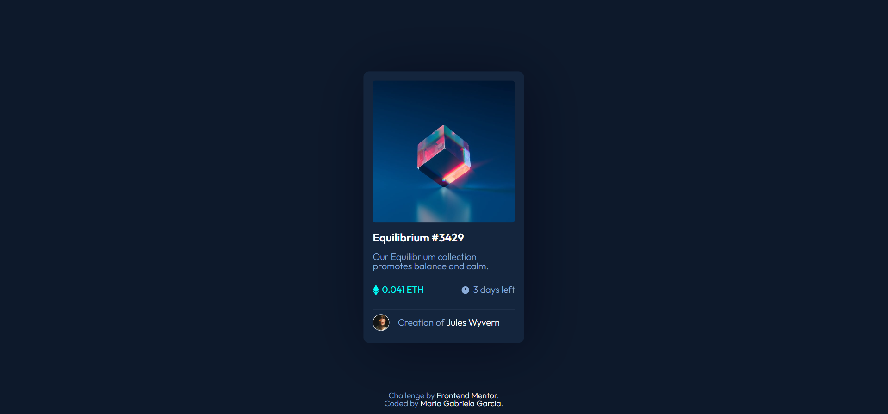

# :bulb: Frontend Mentor - Solução de Desafio

Esta é uma solução para o [NFT preview card component challenge on Frontend Mentor](https://www.frontendmentor.io/challenges/nft-preview-card-component-SbdUL_w0U). Frontend Mentor challenges help you improve your coding skills by building realistic projects. 

### :zap: O desafio

Os usuários devem ser capazes de:

- Visualizar o layout ideal dependendo do tamanho da tela do dispositivo
- Ver os estados de foco para elementos interativos

### :camera: Captura de tela

Esse é o meu resultado final da solução do desafio :)

### :small_blue_diamond: Links

- URL da solução: [repositório da solução no Github](https://github.com/mgabrielag/nft-card)
- URL do site ao vivo: [Clique aqui para ver o projeto hospedado.](https://nft-card-six-sigma.vercel.app/)

## :flags: Meu processo

1) Avaliei o design definindo como seria a estruturação do HTML
2) Codei o HTML com ajuda do Emmet.
3) Criei os arquivos CSS estruturando-os por seções da página.
4) Criei as variáveis necessárias de cores e fontes no arquivo base do CSS, para facilitar futuras manutenções no código.
5) Codei a estilização da página com CSS, seguindo o fluxo de trabalho mobile-first.
6) Adaptei a estilização para Desktop.

### :wrench: Construído com

- Marcação HTML5 semântica com Emmet
- Propriedades personalizadas de CSS
- Flexbox
- Fluxo de trabalho mobile-first

### :white_check_mark: O que eu aprendi

Nesse projeto o meu maior desafio foi codar o overlay de imagens, testei de diversas formas até chegar no resultado final. O lado bom disso é que aprendi mais sobre a propriedade position do CSS! 

Além disso, fixei melhor a forma de projetar sites responsivos com as queries.

### :rocket: Desenvolvimento contínuo

Nos próximos projetos gostaria de praticar o posicionamento com CSS Grid, fixando melhor seus conceitos, assim como fiz com Flexbox.

## :girl: Autor

- Linkedin - [Maria Gabriela Garcia](www.linkedin.com/in/mgabriela-garcia)
- Perfil no Frontend Mentor- [@mgabrielag](https://www.frontendmentor.io/profile/mgabrielag)

## :heart: Agradecimentos

Agradeço ao Frontend Mentor e sua equipe por proporcionar uma forma dos estudantes praticarem o desenvolvimento Front-end. 
